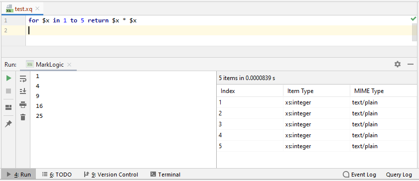

## IntelliJ XQuery Plugin

This is a plugin for IntelliJ IDE 2018.1 &ndash; 2019.1 that adds support
for the XML Query (XQuery) language. This covers support for:
1.  XQuery 1.0, 3.0, and 3.1;
1.  XQuery and XPath Full Text extension;
1.  XQuery Update Facility 1.0, and 3.0 extension;
1.  XQuery Scripting extension;
1.  EXPath extensions;
1.  BaseX, MarkLogic, and Saxon vendor extensions.

This plugin provides support for the following implementations of XQuery:

1.  BaseX 7.0 &ndash; 9.1;
1.  eXist-db 4.4;
1.  MarkLogic 8.0 &ndash; 9.0;
1.  Saxon 9.2 &ndash; 9.9.

See https://rhdunn.github.io/xquery-intellij-plugin/ for the plugin documentation
and tutorials.

#### IntelliJ Integration

This plugin provides integration with the following IntelliJ features:
1.  Resolving URI string literal, function, and variable references;
1.  Code folding;
1.  Find usages;
1.  Paired brace matching;
1.  Commenting code.

#### Run Configurations

This plugin supports running the following query types on the supported databases and processors:

1.  BaseX &ndash; XQuery
1.  eXist-db &ndash; XQuery
1.  MarkLogic &ndash; XQuery, XSLT, SPARQL, SQL, JavaScript
1.  Saxon &ndash; XPath, XQuery, XSLT

MarkLogic also supports profiling XQuery and XSLT queries.

-----

Copyright (C) 2016-2019 Reece H. Dunn

This software and document includes material copied from or derived from the
XPath and XQuery specifications. Copyright © 1999-2017 W3C® (MIT, ERCIM, Keio,
Beihang).

The IntelliJ XQuery Plugin is licensed under the [Apache 2.0](LICENSE) license.
