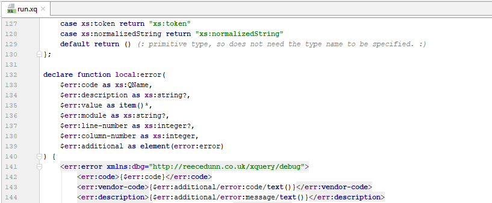
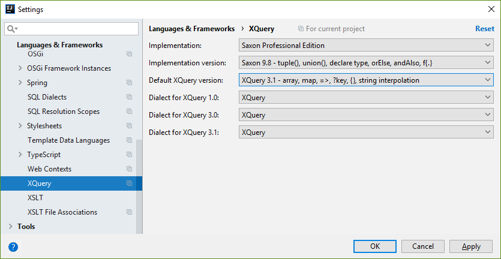
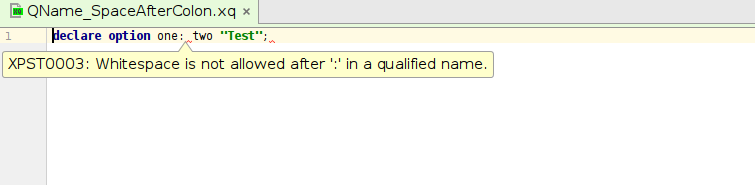
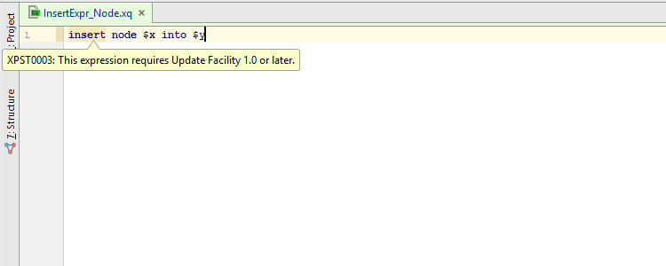
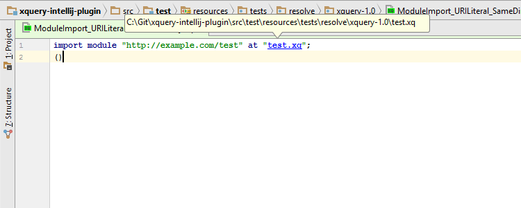

# IntelliJ XQuery Plugin

- [Features](#features)
  - [Language Support](#language-support)
  - [Warnings and Errors](#warnings-and-errors)
  - [IntelliJ Integration](#intellij-integration)
- [License Information](#license-information)

----------

This project provides XQuery support for the IntelliJ IDE.

_Supported IntelliJ Platforms:_ IntelliJ IDEA Community, IntelliJ IDEA Ultimate,
PhpStorm, WebStorm, PyCharm, RubyMine, AppCode, CLion, Rider, Android Studio

_Supported IntelliJ Versions:_ 2016.1 - 2017.1

_Supported XQuery Implementations:_ BaseX, MarkLogic, Saxonica, W3C Specifications

## Features

### Language Support

A robust, standard conforming XQuery syntax highlighter and parser with file encoding
detection. It supports the following XQuery specifications:

*  XQuery 1.0, 3.0 and 3.1 core language;
*  XQuery Update Facility 1.0 and 3.0;
*  XQuery Scripting Extension 1.0.

It supports the following XQuery syntax extensions:

*  BaseX 7.8 and 8.5 `update` syntax;
*  Saxon 9.4 `map` syntax;
*  MarkLogic 6.0 to 8.0 vendor extensions.

It has support for xqDoc documentation comments.

The plugin provides control over how XQuery dialects are interpreted.

## Warnings and Errors

Helpful error messages for invalid XQuery constructs.

Warnings for XQuery constructs that are valid in a different version or extension
to the one configured in the project.

## IntelliJ Integration

Resolve URI string literals to the files they reference.

Resolve namespaces, functions and variables to their corresponding declarations.

Code folding is supported for the following elements:

*  Comment;
*  DirElemConstructor;
*  EnclosedExpr (including function bodies).

Other supported IntelliJ features:

1.  Find usages.
2.  Paired brace matching.
3.  Commenting code support.

## License Information

Copyright (C) 2016-2017 Reece H. Dunn

The IntelliJ XQuery Plugin is licensed under the [Apache 2.0](LICENSE)
license.
